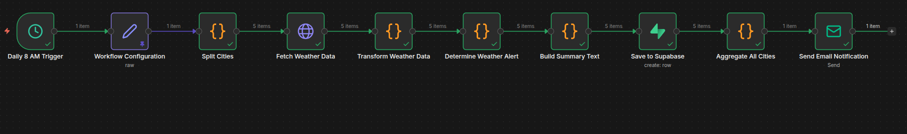
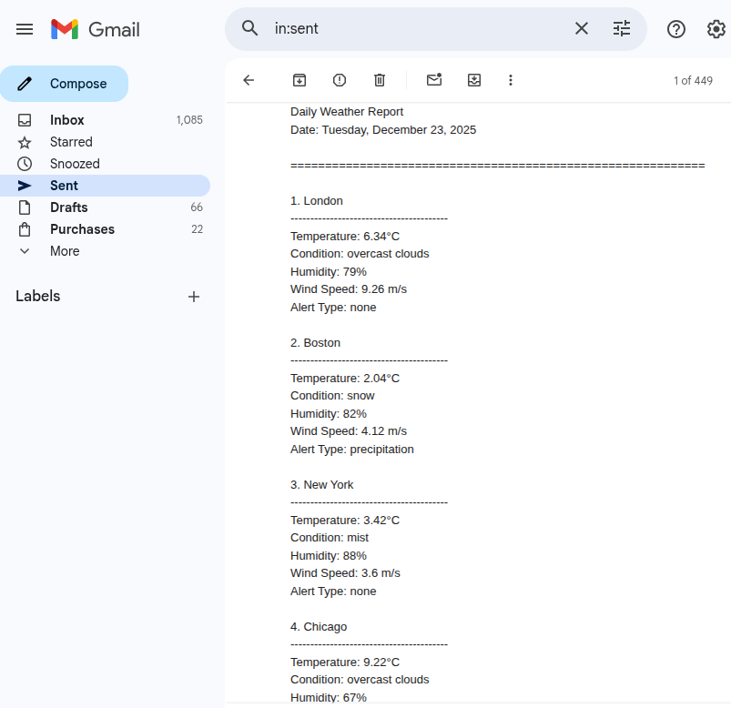

# Daily-Weather-Alert-Workflow--n8n
This n8n workflow fetches daily weather data for one or multiple cities, determines weather alerts (rain, heat, frost), saves the data to a Supabase table, and sends a daily email summary.

---

## 1. API Setup & Key Configuration
1. Sign up at [OpenWeatherMap](https://openweathermap.org/api) and get an **API key**.  
2. In the workflow, open the **Workflow Configuration** node:  
   - Set `apiKey` to your OpenWeatherMap API key. I have set it blank for security 
   - Set `city` to one or multiple cities separated by commas (e.g., `London, New York, Kathmandu`).  
   - Set `recipientEmail` to the email address that should receive daily updates.  

---

## 2. Supabase Details
1. Create a free Supabase project at [https://supabase.com/](https://supabase.com/).  
2. Create a table named `weather_logs` with the following schema:  

| Column           | Type       |
|-----------------|------------|
| id               | UUID/serial|
| run_at           | timestamp  |
| city             | text       |
| temperature      | float      |
| temperature_unit | text       |
| condition        | text       |
| humidity         | int        |
| wind_speed       | float      |
| alert_type       | text       |
| raw_response     | json/text  |

3. Add **Supabase credentials** in n8n and connect them to the **Save to Supabase** node.  

---

## 3. Email Configuration
1. Set up an SMTP email account (Gmail, Outlook, etc.) in n8n credentials.  
2. In the **Send Email Notification** node:  
   - `fromEmail`: your sending email  
   - `toEmail`: `={{ $('Workflow Configuration').first().json.recipientEmail }}`  
   - `subject`: `Daily Weather Report - Multiple Cities - {{ $now.format('yyyy-MM-dd') }}`  
   - `text`: `={{ $('Aggregate All Cities').first().json.summary }}`  

---

## 4. How to Import & Run the Workflow
1. Export this workflow as a `.json` file.  
2. In n8n, go to **Workflows → Import from File** and select the exported `.json`.  
3. Activate the workflow. It will run automatically every day at 8 AM (configured in the **Daily 8 AM Trigger** node).  
4. Optionally, you can test manually by executing the workflow.  

---

## Features
- Daily automated weather fetching and alerts  
- Proper logging in Supabase  
- Clean email summaries sent to your recipients  
- Supports multiple cities and additional weather metrics (pressure, visibility, clouds, sunrise/sunset)  

---
## Screenshots

### Screenshot 1

### Screenshot 2
